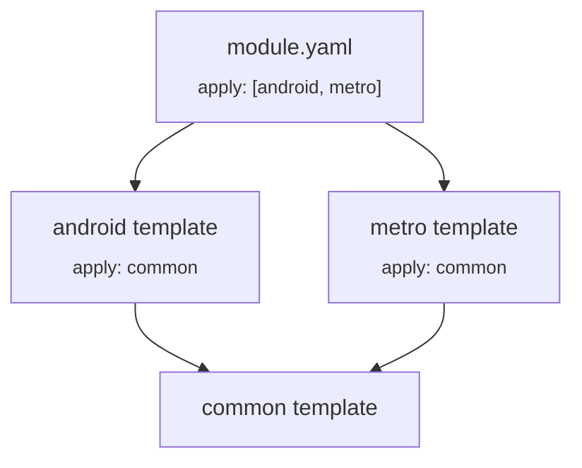

# Templates

In modularized projects, some parts of the configuration are usually the same for some or all modules.
The most common are the JDK version, the Kotlin version, compiler arguments, repositories, and publishing configuration.

The Kotlin Toolchain offers a way to extract whole sections or their parts into reusable template files.

## Basics

Template files are named `<name>.module-template.yaml` and have the same structure as `module.yaml` files.

!!! note

    Template files cannot have a `product:` section, but `@platform`-qualifiers are supported.

A template is applied to a `module.yaml` file by listing it in the `apply:` section.
The [path](basics.md#path-notation) to a template usually starts with `//` and is relative to the project root directory 
(where `project.yaml` is located).

<div class="grid" markdown>
<div class="annotate">
```yaml title="module.yaml"
product: jvm/app

apply: 
  - //common.module-template.yaml

dependencies:
  - io.ktor:ktor-client:3.5.1
```
</div>

<div class="annotate">
```yaml title="//common.module-template.yaml"
repositories:
  - https://my.company/maven

settings:
  kotlin:
    version: 2.4.10
‎
```
</div>
</div>

When doing this, the contents of the template are merged with that of the module file, to give an effective 
configuration that looks like this:

```yaml title="Effective module config"
product: jvm/app

repositories:
  - https://my.company/maven

dependencies:
  - io.ktor:ktor-client:3.5.1

settings:
  kotlin:
    version: 2.4.10
```

You can see the effective configuration of a module using the `show settings` command:

```shell
kotlin show settings --module=my-module
```

## Nested templates

It is possible to apply templates to other templates by using the same `apply` section in the template files:

```yaml title="java.module-template.yaml"
settings:
  jvm:
    release: 11
```

```yaml title="spring.module-template.yaml"
apply:
  - //java.module-template.yaml

settings:
  springBoot: enabled
```

```yaml title="module.yaml"
product: jvm/app

apply:
  - //spring.module-template.yaml
```

The resulting effective module is:

```yaml title="Effective module.yaml"
product: jvm/app

settings:
  jvm:
    release: 11
  springBoot: enabled
```

## Resolution rules

### Precedence

The precedence is determined between entire files (`module.yaml` and templates).
The position of the `apply` section within a file doesn't matter.

The basic rules are simple:

* The `module.yaml` always takes precedence over the templates that it applies.
* A template takes precedence over the other templates that it applies (and so on, transitively).

Some pairs of templates do not apply each other even transitively, so they don't have any precedence over each other.
If such templates happen to disagree on the value of a property in the configuration, we may have a _conflict_
(see [conflict resolution](#conflict-resolution) below).

The `module.yaml` and templates essentially form a graph via `apply:`.
To respect the rules above, the effective configuration is constructed by starting from the deepest nested template(s),
and merging the contents by going level by level in that graph (topological order), following the 
[merging rules](#merging-rules) (see below).

For example:



1. the contents of the `common` templates are a starting point
2. the contents of `android` and `metro` are merged on top. They have precedence over `common`, but they don't have
   precedence over each other, so their order doesn't matter here. If they try to set the same property to different 
   values, we have a conflict (see [conflict resolution](#conflict-resolution) below).
3. the contents of the `module.yaml` file are added last.

### Merging rules

Templates are applied using the same merging rules as
[platform-specific dependencies and settings](multiplatform.md#dependencysettings-propagation):

- Scalar values (strings, numbers etc.) are **overridden**.
- Mappings and lists are **appended**.

To determine who overrides who, we use the precedence rules defined in the previous section.
Here is an example:

<div class="grid" markdown>
<div class="annotate">
```yaml title="module.yaml"
product: jvm/app

apply:
  - //common.module-template.yaml

dependencies:
  - //jvm-util

settings:
  kotlin:
    version: 2.3.21
  jvm:
    release: 17
```
</div>

<div class="annotate">
```yaml title="common.module-template.yaml"
dependencies:
  - //shared

settings:
  kotlin:
    version: 2.4.10
  compose: enabled
```
</div>
</div>

After applying the template, the resulting effective module is:

```yaml title="Effective module.yaml"
product: jvm/app

dependencies:  # lists appended
  - //shared
  - //jvm-util

settings:  # objects merged
  kotlin:
    version: 2.3.21  # module.yaml value takes precedence
  compose: enabled   # from the template
  jvm:
    release: 17      # from the module.yaml
```

Each template is applied to the resulting module only once even if it is applied in multiple templates used in a module. E.g.:

```yaml title="common.module-template.yaml"
dependencies:
  - //core-lib
```

<div class="grid" markdown>
<div class="annotate">
```yaml title="client.module-template.yaml"
apply:
  - //common.module-template.yaml

dependencies:
  - //client-lib
```
</div>

<div class="annotate">
```yaml title="server.module-template.yaml"
apply:
  - //common.module-template.yaml

dependencies:
  - //server-lib
```
</div>
</div>

```yaml title="module.yaml"
product: jvm/app

apply:
  - //client.module-template.yaml
  - //server.module-template.yaml
```

will result in the effective module:

```yaml title="module.yaml"
product: jvm/app

dependencies:
  - //core-lib   # core-lib is added to the list only once
  - //client-lib
  - //server-lib
```

### Conflict resolution

If two templates define different scalar values for the same property and neither template has precedence over the other
in the `apply` graph, the Kotlin Toolchain reports a conflict.

<div class="grid" markdown>
<div class="annotate">
```yaml title="java17-compatible.module-template.yaml"
settings:
  jvm:
    release: 17
```
</div>

<div class="annotate">
```yaml title="java21-compatible.module-template.yaml"
settings:
  jvm:
    release: 21
```
</div>
</div>

With only `java17-compatible` and `java21-compatible`, `settings.jvm.release` is conflicting (`17` vs `21`) 
because these templates are siblings.

```yaml title="module.yaml"
product: jvm/app

apply:
  - //java17-compatible.module-template.yaml
  - //java21-compatible.module-template.yaml

# Error: Conflicting values for property `release`
```

You can solve the conflict by explicitly setting the property value in the module applying both templates:

```yaml title="module.yaml"
product: jvm/app

apply:
  - //java17-compatible.module-template.yaml
  - //java21-compatible.module-template.yaml

settings:
  jvm:
    release: 21 #(1)!
```

1. The explicitly set value `21` takes precedence over conflicting values,
   and no conflict is reported

If you still want to keep the setting as a template, you can resolve it by introducing a template that applies both 
conflicting templates __and__ defines the final value.

```yaml title="java-runtime-policy.module-template.yaml"
apply:
  - //java17-compatible.module-template.yaml
  - //java21-compatible.module-template.yaml

settings:
  jvm:
    release: 21
```

```yaml title="module.yaml"
product: jvm/app

apply:
  - //java-runtime-policy.module-template.yaml #(1)!
```

1. The value of `jvm.release` coming from `java-runtime-policy` template takes precedence over conflicting values
   from `java17` and `java21` templates, and no conflict is reported
